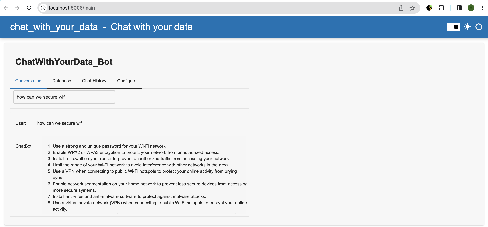
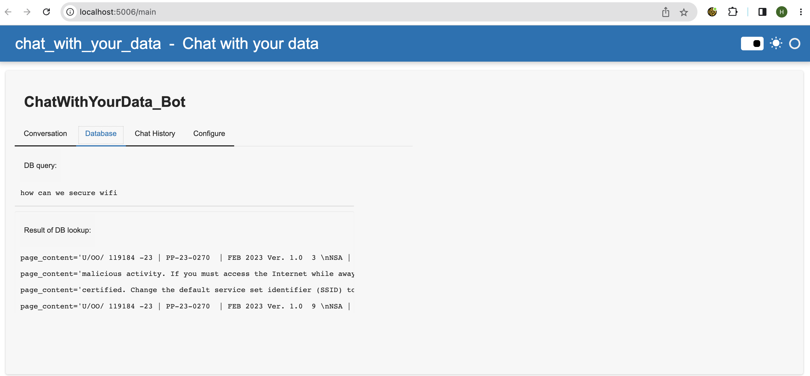
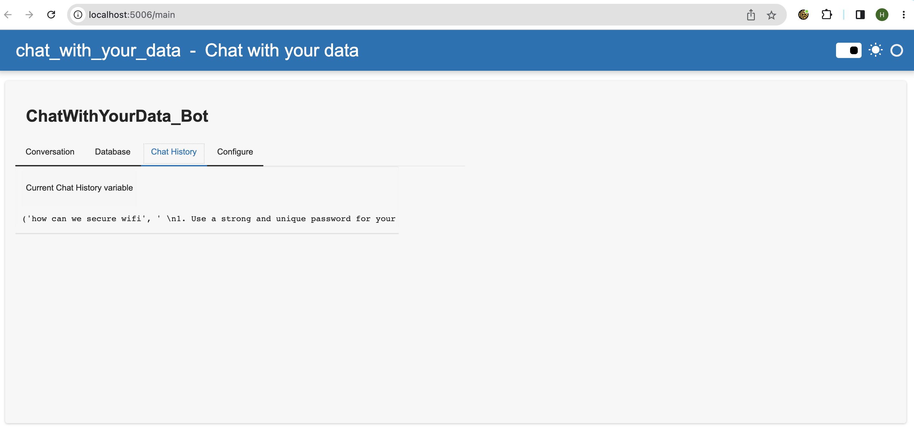
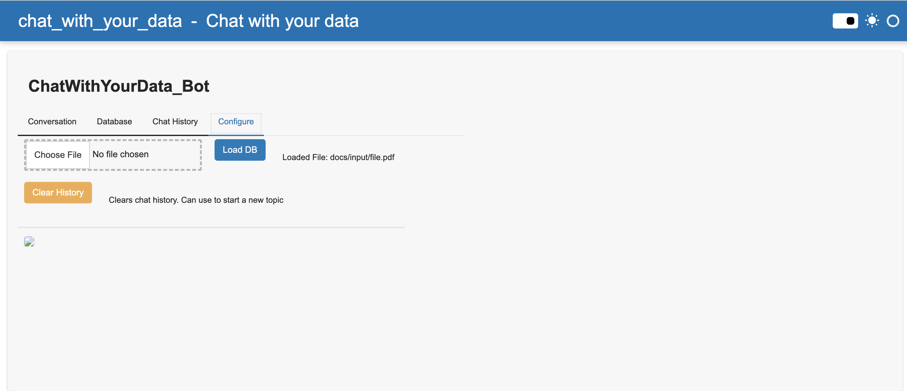

# Overview

Simple tool to upload a pdf file and ask a question about it.

Original source code is from the short course - https://www.deeplearning.ai/short-courses/langchain-chat-with-your-data/

# Known issues

- The file upload utility in `Configure` tab does not work. I am just copying over the pdf file to `./docs/input` directory.
- The conversation window does not scroll, we might need to refresh the whole page once to see new content

# How to use

- Copy PDF to `/docs/input`
- Download models and save them to `/models` directory (orca-mini-3b is from [here](https://huggingface.co/TheBloke/orca_mini_3B-GGML/blob/main/orca-mini-3b.ggmlv3.q4_0.bin))
- Install python modules with `pip install -r requirements.txt` (I am using Python 3.9.16)
- Run `panel serve main.py --show` 

# Screenshots

### Conversation tab

### Database tab

### Chat history tab

### Configure tab

